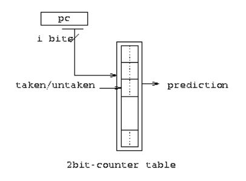
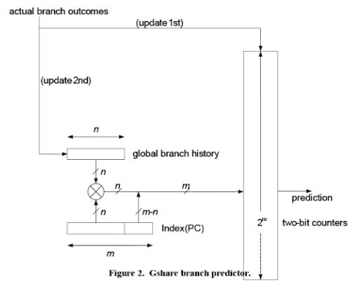
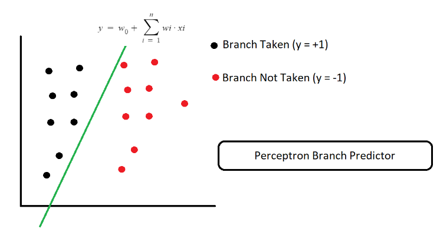

># ES215 Project Report

> **Title**: Analysing Branch Predictors' Performance on ChampSim

1. [Week 1](#week-1)
   1. [Task 1](#task-1)
      1. [Task 1.1](#task-11)
      2. [Task 1.2](#task-12)
   2. [Task 2](#task-2)
      1. [Insights](#insights)
         1. [Do different benchmark traces have different prediction rates?](#do-different-benchmark-traces-have-different-prediction-rates)
         2. [Relating Branch Prediction Rate with Performance](#relating-branch-prediction-rate-with-performance)
         3. [Relating Branch Prediction Rates to Design of Branch Predictors](#relating-branch-prediction-rates-to-design-of-branch-predictors)

# Week 1

## Task 1
> **Log**

1. We cloned ChampSim from GitHub, on three different environments.
   1. Windows Subsystem for Linux (WSL) Ubuntu 18.04
   2. Ubuntu  18.04 on Virtual Box
   3. !Pop_OS (Linux Distribution Based on Ubuntu)
2. Installed essential [dependencies](https://arpitkaushal.github.io/champsim). 
3. Ran the following script. Can be downloaded [here](https://arpitkaushal.github.io/champsim/scripts/task-1.sh). 

> **Script**

``` bash
cd ..

mkdir -p logs

echo  'TASK 1\nStart Time: ' >> ./logs/task-1.txt
echo  'TASK 1 ERRORS/WARNINGS\n' >> ./logs/task-1-err.txt

exec 1>> ./logs/task-1.txt 
exec 2>> ./logs/task-1-err.txt 

./build_champsim.sh bimodal no no no no lru 1    # single core build
echo '\n\nBuild Completed. Running the 1 core build.\n\n' 
./run_champsim.sh bimodal-no-no-no-no-lru-1core 1 10 400.perlbench-41B.champsimtrace.xz # single core run
echo '\n\nTask 1 Part 1 completed!\n\n'


./build_champsim.sh bimodal no no no no lru 4    # four core build
echo '\n\nBuild Completed. Running the 4 core build.\n\n' 
./run_4core.sh bimodal-no-no-no-no-lru-4core 1 10 0 400.perlbench-41B.champsimtrace.xz 454.calculix-104B.champsimtrace.xz 603.bwaves_s-5359B.champsimtrace.xz 649.fotonik3d_s-1B.champsimtrace.xz # 4 traces run
echo '\n\nTask 1 Part 2 completed!\n\n'

echo '\n\nTask 1 completed! :)\n\n'

exit
```

The script ran successfully. Details of the simulations are given below.

### Task 1.1

> Built a CPU with the following **parameters** -
    
    Branch Predictor: Bimodal
    Warmup Instructions: 1 million
    Simulation Instructions: 10 million
    Number of CPUs: 1
    Prefetchers: None
    Off-chip DRAM Size: 4096 MB

**Results from Task 1.1**

    Heartbeat instructions: 10000003 
    cycles: 17581198 
    heartbeat IPC: 0.56879 
    cumulative IPC: 0.525805 
    Simulation time: 21 sec 
    
    Finished instructions: 10000000 
    cycles: 18628767 
    cumulative IPC: 0.5368 04 
    Simulation time: 23 sec

    Branch Prediction Accuracy: 95.4821% 
    MPKI: 9.4899 
    Average ROB Occupancy atMispredict: 51.163

### Task 1.2

> Built a system of 4 CPUs with the following ***common* parameters** -
    
    Branch Predictor: Bimodal
    Warmup Instructions: 1 mil
    Simulation Instructions: 10 mil
    Prefetchers: None
    Off-chip DRAM Size: 4096 MB

**Results from Task 1.2**

|Traces Used     |CPU `i`|
|----------------|-------|
|400.perlbench   |CPU `0`|
|454.calculix    |CPU `1`|
|603.bwaves      |CPU `2`|
|649.fotonik3d   |CPU `3`|


| Parameters                      | CPU 0    | CPU 1   | CPU 2   | CPU 3    |
|---------------------------------|----------|---------|---------|----------|
| **CPU Comp. Time (in sec)**     | 138      | 68      | 67      | 79       |
| **Cumulative IPC**              | 0.536671 | 1.18435 | 1.19862 | 0.990379 |
| **Branch Pred. Acc. (in %)**    | 95.4821  | 72.2496 | 88.7848 | 96.1452  |
| **MPKI**                        | 9.4899   | 24.8147 | 14.9489 | 9.09982  |
| **ROB Occupancy at Mispredict** | 51.1779  | 28.1235 | 20.2697 | 48.011   |

## Task 2

> **Log**

1. Built **4** single core CPUs with the following branch predictors - 
   - Bimodal
   - Gshare
   - Hashed Perceptron
   - Perceptron
2. Ran the following four traces on each of the builds - 
    - 454.calculix-104B.champsimtrace.xz
    - 603.bwaves_s-5359B.champsimtrace.xz
    - 649.fotonik3d_s-1B.champsimtrace.xz
    - 654.roms_s-1021B.champsimtrace.xz
3. So, a total of 16 simulations were run. Automated the processs by writing (and running) [this](https://arpitkaushal.github.io/champsim/scripts/task-2.sh) `Bash` script.
4. Common Parameters for all simulations :
       
       Warmup Instructions: 1 million
       Simulation Instructions: 10 million
       Number of CPUs: 1
       Off-chip DRAM Size: 4096 MB 

### Insights

#### Do different benchmark traces have different prediction rates?

Below table shows Prediction rates of four different branch predictors for four different benchmark traces. 

| Traces        | Bimodal | Gshare  | Hashed Perceptron | Perceptron |
| ------------- | ------- | ------- | ----------------- | ---------- |
| 454.calculix  | 72.2378 | 96.8821 | 99.6659           | 96.9556    |
| 603.bwaves    | 87.5014 | 93.5709 | 99.8845           | 91.48      |
| 649.fotonik3d | 96.145  | 98.2442 | 99.8778           | 99.0743    |
| 654.roms      | 81.4508 | 97.92   | 99.8879           | 98.1034    |

**Inference:** Different benchmark traces have different predictions rates. 
Here, `649.fotonik3d` has the best prediction rate among all the benchmark traces for any given branch predictor. From this data, it appears as if the trace `649.fotonik3d` has **instructions that follow a defined pattern**, and thus all branch predictors work well for it. 
Conversely, `454.calculix` shows the widest range in prediction rates; apparenty implying that it's instruction set doesn't conform to a pattern as strongly as the other traces. 


#### Relating Branch Prediction Rate with Performance

If the prediction is correct, then there is no penalty in terms of clock cycles. If the prediction is incorrect, which means the corresponding instructions within the Instruction Fetch, Instruction Decode and Execution stages are wrong and need to be cleared. This leads to waste of clock cycles and the processor pays a penalty. More the cycles required to process a set of instructions, lower the IPC and lower the performance.

High Prediction rate means the branch predictor is successful in making a good amount of correct predictions and hence the processor pays less penalty in terms of the clock cycle. Thus, the higher IPC and better higher performance.

Each of the graph below, depicts how performance changes for different Branch Predictors (and hence, different `BP Rates`) with respect to a given trace. 
We acknowledge that for each of these plots are composed for four data-points. ***Assuming***, that these graphs extrapolate for other prediction rates, there seems to be a **direct relation** between the two quantities. 
In essence, **if the a Branch Predictor offers a better prediction rate for a trace, then it is likely to perform better (`higher IPC`).**


Here, `Performance` is measureed in `Instructions Per Cycle` (aka `IPC`).


#### Relating Branch Prediction Rates to Design of Branch Predictors

- Branch Predictors try to enhance the probability of predicting the conditional branch instruction right. When you have a conditional branch instruction, you have two possibilities, either executing the branch instruction when this branch instruction is taken or executing the instruction specified by that branch instruction when this branch is NOT taken. So, we have a  50% chance to get the prediction right. Branch predictors try to eliminate some of the stalls during misprediction and thus reduce the penalty the processor pays in terms of the clock cycle.
- Having a good branch predictor can help to bring down the execution time of a processor. 
- Branch predictors do this by keeping the record of each branch instruction (PC). This record helps us to learn about that particular branch instruction, so when I revisit it, it will update the information and thus learn more every time the branch instruction is encountered. 

>**Bimodal Branch Predictors:** 



- Bimodal branch predictors use a branch history table or branch prediction buffer to store the data of saturated counters. It is a small part of memory with the address( a part of the entire address) of branch instruction as an index. 
- Every time the branch is NOT taken, you increment the value of the saturated counter unless it is max or 11( saturated up). Every time the branch is taken, you decrement the value of the saturated counter unless it is min or 00( saturated down). So, next time you encounter this particular branch instruction, it sees the value of the saturated counter and makes a decision accordingly. 
- You are looking at each instruction locally and updating the local counter associated with it. This makes it simple and cheap. However, it does not have a high Prediction rate due to the single level of history involved in prediction.

>**Gshare Branch Predictors:**



- Gshare uses the same method of branch prediction buffer to store data of saturated counters for each branch instruction. However  it has some additional features that makes it a better predictor.
- Bimodal branch predictors use only the local information about a particular branch. It is noted that you can generate higher prediction accuracy by using both local prediction information and the global prediction of the  recently executed branches. 

**Global branch history:** it will allow you to connect the prediction of one branch instruction with predictions of other branch instructions. It is n-bits( same bits as PC), These n-bits change with the predictions of each instruction( as shown in the figure, the prediction is an input for the Global branch history) and is thus called global. 

The selection from the branch prediction buffer is the result of the XOR between the current branch instruction’s address and the Global branch history. Thus, you can get a different prediction counter for the same instruction because the global history changes every time. **This makes Gshare better in terms of prediction rate than Bimodal as Gshare has two levels of history involved as compared to single level in Bimodal.**

The below table shows the Branch Prediction rates for different Branch predictors.

| Traces        | Bimodal | Gshare  |
| ------------- | ------- | ------- |
| 454.calculix  | 72.2378 | 96.8821 |
| 603.bwaves    | 87.5014 | 93.5709 |
| 649.fotonik3d | 96.145  | 98.2442 |
| 654.roms      | 81.4508 | 97.92   |

>**Perceptron Branch Predictors:** 

- In this branch predictor a Perceptron is used to predict whether the predictor will predict a branch to be taken or not. Previous branch prediction history (local or global) is used as input to the perceptron and decision boundary between data is drawn. 
  $$y = w_0 + \sum_{i=0}^{n}{w_i*x_i} $$
- Here, output $y$ is predicted as -1 if branch is not taken and +1 if it is taken. The performance of prediction depends on the nature of the classification boundary i.e. whether it is a line or a curve. Perceptron branch predictor works better if the data is linearly separable. Although modern ANN can predict the more complicated boundaries but a lot more expensive.
- Perceptron branch predictors perform very well in most of the predictions with low branch misprediction.

|                       Parameter              | 454.calculix | 603.bwaves | 649.fotonik3d | 654.roms |
| ----------------------------------- | ------------ | ---------- | ------------- | -------- |
| Accuracy                            | 96.9556      | 91.48      | 99.0743       | 98.1034  |
| Misprediction per 1000 instructions | 2.7431       | 12.2815    | 2.2011        | 3.0796   |

According to our observation, the **`Performance`** difference is because the **`Bimodal BP`** has to find the branch target address using local history on which it performs operations to find a new address to target the branch. And while it mispredicts the branch, FSM is used to update the bits associated with the current target branch. On the other side, **`Perceptron`** uses only one computation which is simply a line equation computation to predict whether the branch will be taken or not. **`Perceptron`** uses Global history and local history to change the weights of the perceptron equation and that equation is used for further predictions, While in the **`Bimodal BP`** FSM is used to change only current prediction bits if misprediction occurs and this benefits a lot in the branches involving loops.



Thus, the performance is impacted by the design of the predictor which we can see in the performance comparison table from first insight.

<!-- |               | Bimodal B.P Accuracy(%) | Perceptron B.P Accuracy(%) |
| ------------- | ----------------------- | -------------------------- |
| 454.calculix  | 72.2378                 | 96.9556                    |
| 603.bwaves    | 87.5014                 | 91.48                      |
| 649.fotonik3d | 96.145                  | 99.0743                    |
| 654.roms      | 81.4508                 | 98.1034                    | -->


<!-- 
>### Relation of Performance difference and Predictor design for Bimodal (or counter-based predictors) and Perceptron Branch Predictor -->


<!-- | Traces        | Bimodal | Gshare  | Hashed Perceptron | Perceptron |
| ------------- | ------- | ------- | ------------------ | ---------- |
| 454.calculix  | 72.2378 | 96.8821 | 99.6659            | 96.9556    |
| 603.bwaves    | 87.5014 | 93.5709 | 99.8845            | 91.48      |
| 649.fotonik3d | 96.145  | 98.2442 | 99.8778            | 99.0743    |
| 654.roms      | 81.4508 | 97.92   | 99.8879            | 98.1034    | -->

<!-- Coloumn-wise analysis of the above table indicates that different predictors have different prediction rates.
Here, `hashed_perceptron` is most efficient, followed by `perceptron`, `gshare` and `bimodal`.  -->

<!-- >**Bimodal branch predictor :**
- The bimodal branch predictor uses 2-bit saturated counters. This counters helps to keep the track of the result( branch taken or not taken) in the previous encounter of this branch  instruction.
- Data for every branch instruction’s 2 bit Saturated counter is stored in a Branch Predictor table. This table updates after any  counter of any branch instruction changes. 
- Every time if branch is taken, you increment the value of saturated counter unless it is max or 11.
- Every time if branch NOT taken, you decrement the value of saturated counter unless it is minimum or 00.
- So, next time you encounter this particular branch instruction, it see the value  of the saturated counter and act accordingly.

>**Gshare:**
- Gshare uses the same history table or branch prediction table but  also uses the Program Counter to check if the branch is to be taken or not.
- It XORs value of saturated  counter of instruction from the branch prediction table with PC ( program counter). This provides it a more performance advantage in terms of prediction accuracy.
- It allows better utilization of PHT.
But increases access latency. -->


>#### For detailed data of performed Tasks, visit this [sheet](https://docs.google.com/spreadsheets/d/1b-Ukc_Z3UOM-HvSgm8sXch7t5NGe4OtT3ldNIUDDV4M/edit?usp=sharing). 


